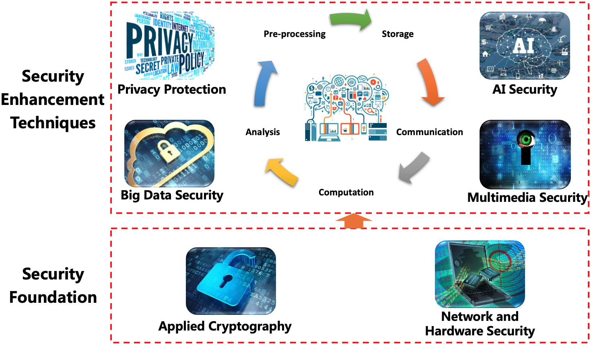

# 研究方向

我们的团队主要致力于信息安全的前沿研究，包括：应用密码学、人工智能安全、大数据安全与隐私保护、多媒体安全、新一代网络与物理层安全等。我们的目标是在21世纪新环境下计算机技术飞速发展的背景下，解决计算机和人工智能领域潜在的安全问题。我们在已经在国内外顶级学术会议（如NDSS, AaiaCCS, ICDE, INFOCOM, CVPR, MM, AAAI, IJCAI）和期刊（如TIFS, TDSC, TC, TMM, TCSVT, TMM, TOMM）上发表了多篇研究成果成果。 课题组经费充足，定期组织学术和户外活动，不仅为学生提供了国际领先的科研环境，也营造了良好的生活氛围。 我们的课题组与中科院、华为、中兴通讯、大唐电信以及南洋理工大学、香港浸会大学、乔治梅森大学、弗吉尼亚理工大学 和 新加坡国立大学等海外高校有密切合作。

以下是我们目前正在研究的一些主题和技术：

## 应用密码学
密码学作为用于控制数据访问的重要工具，被广泛的应用于任何传输、处理、存储数字化信息的场景中，是现代信息化社会构建的基石之一。当前，密码学研究的目标早已从最初的通信安全扩展到了计算安全。然而，现有密码学方案通常需要复杂的计算或通信，同时部署困难，导致其实用性较弱。团队旨在设计新型密码学方案与实用化现有密码学方案，为密码学方案在不同的场景的应用与部署提供保障。

<a href="/zh-cn/posts/applied-cryptography/">了解更多 <i class="fas fa-angle-double-right fa-fw"></i></a>

## 人工智能安全
人工智能已成为当今世界科技发展和技术变革的重要驱动力，其在计算机视觉、语音识别和自然语言处理领域的广泛应用，已深刻地影响到人类的日常生活。然而，人工智能面临多种隐私和安全问题，并且人工智能系统的高复杂性和难解释性，导致这些安全隐患无法得到有效的检测和预防。特别是无人驾驶、智慧医疗等安全攸关领域，在安全性、可靠性和可解释性方面对人工智能算法和模型提出了更高的要求。团队旨在推动人工智能安全的学术研究及产业实践，探索人工智能安全与隐私保护的新理论、新方法和新技术。

<a href="/zh-cn/posts/artificial-intelligence-security/">了解更多 <i class="fas fa-angle-double-right fa-fw"></i></a>

## 大数据安全与隐私保护
大数据是网络技术进步以及边界扩展所产生的人类行为数据的集合体，通过对行为大数据的分析，可以有效改善人类的生活方式。然而，在这个过程中，大数据的使用面临着严重的质疑。这其中尤其以数据存储、使用过程中的安全性以及数据对个人信息隐私保护问题最为突出。团队旨在大数据安全与隐私保护的产研结合，探究其新技术新理论并将其付诸于理论实践。

<a href="/zh-cn/posts/big-data-security-and-privacy-protection/">了解更多 <i class="fas fa-angle-double-right fa-fw"></i></a>

## 多媒体安全
多媒体旨在表示一种或多种媒体形式的综合，主要包括文本、声音、图像以及视频等多种形式。随着互联网络的普及以及社交网络、在线媒体的飞速发展，产生大量的多媒体数据存在着极其严峻的信息安全问题。多媒体数据所具有的信息量大、相关性强、冗余度高等特点，导致针对此类数据设计的安全方案常常存在着高计算量、高功耗率等局限。团队旨在深入多媒体信息安全的学术研究，为其生成、传输、分发和应用等方面提高可靠的安全保障。

<a href="/zh-cn/posts/multimedia-security/">了解更多 <i class="fas fa-angle-double-right fa-fw"></i></a>

## 新一代网络与物理层安全
物理层安全是指利用自然物理特性来实现信息安全，也可以成为物理内生安全，具体可来实现信息加密、产生密码、辨识合法用户等功能。它是作为上层安全的补充出现的，可以极大地增强整个系统的安全性能。物理层是网络运行的基石,为数据传输提供了物理连接,没有物理层,网络就成了无根之木、无源之水，最基本的是要确保网络物理层的安全运行，因此物理层安全是整个网络安全系统不可缺少和忽视的组成部分。

<a href="/zh-cn/posts/hardware-security/">了解更多 <i class="fas fa-angle-double-right fa-fw"></i></a>

